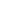

<h1 align="center">Esoteric Enderman</h1>

<a href="https://enderman.dev">enderman.dev</a>

<h2 align="center">Links</h2>

    
    

    
    
    
    

    
    

<h3 align="center">Friends</h3>

    

